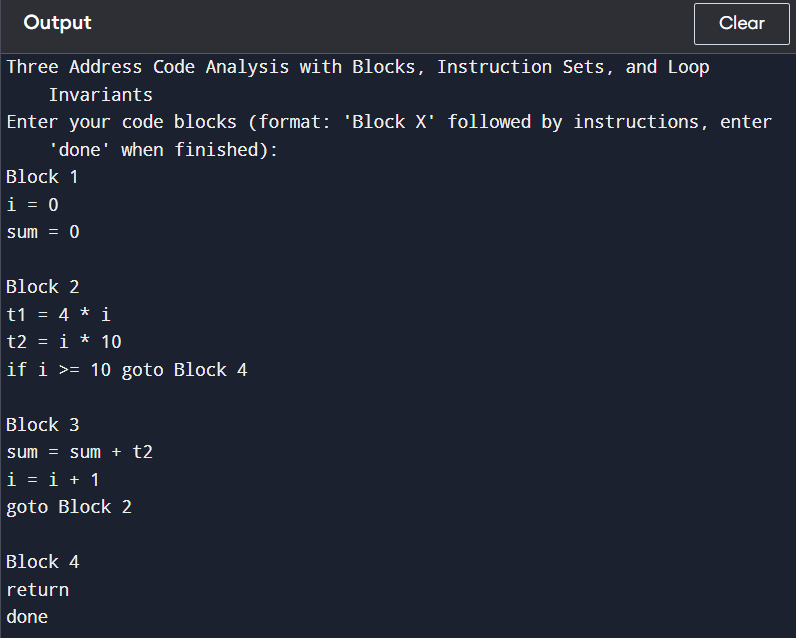
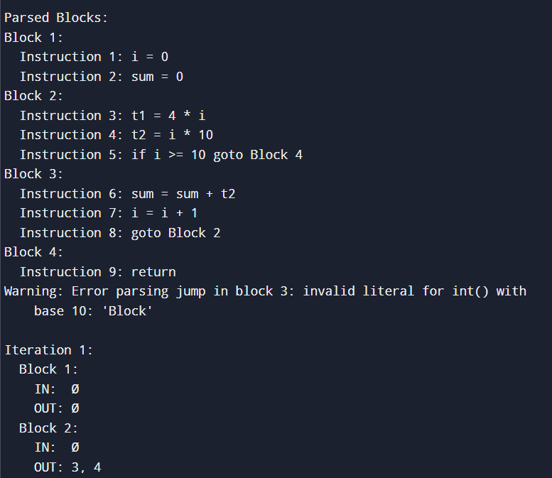
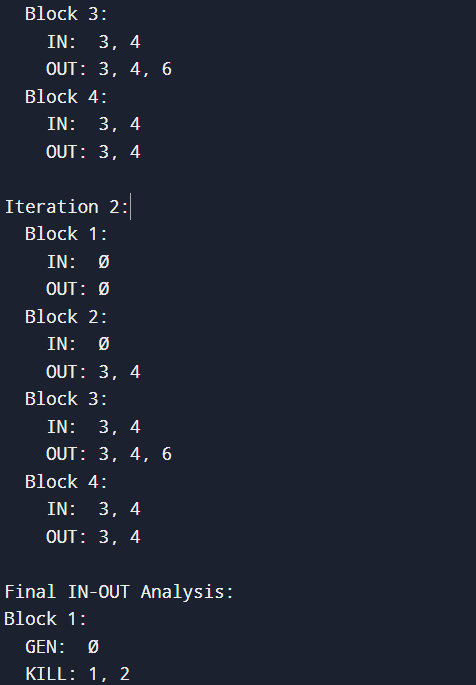
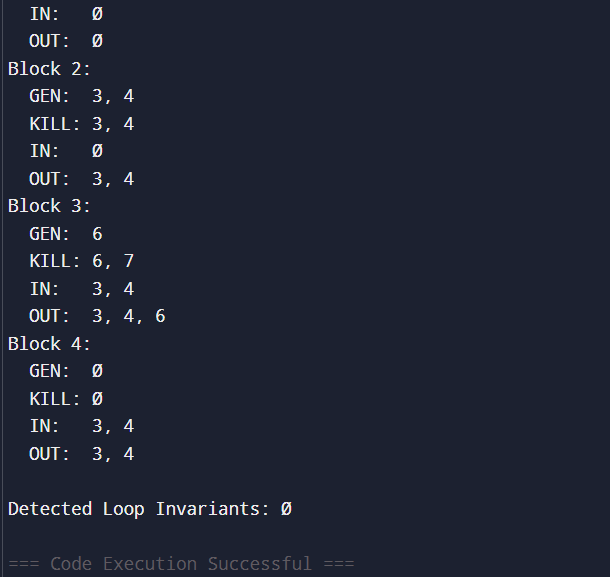

Problem Statement: 
Input the three address code, Perform IN OUT analysis and identify loop invariant computation.

Explanation:
The concept of In and Out sets, along with the use of Gen (generation) and Kill, is part of data flow analysis in compiler theory. Data flow analysis helps optimize and understand the behavior of programs, such as which variables are used or defined at different points in a program. This is particularly useful for optimizations like constant propagation, dead code elimination, and reaching definitions.
In, Out, Gen, and Kill in Data Flow Analysis
These terms are typically used to describe Reaching Definitions Analysis or similar flow analysis techniques. Let's break down each concept:
1. In and Out Sets:
•	In: The In set for a program point (such as a statement or node in control flow graph) contains the information about what is "known" or "available" at that point, based on the flow of the program up to that point.
•	Out: The Out set contains information about what is available at the exit of the node or statement, after executing the node. This is the set of values that will be available after that statement, which can be propagated forward to other nodes.
These sets are part of a system of equations that help compute information flow across a program. The relationship between In and Out is often defined using equations that reflect how data propagates through the program’s control flow graph.
For example:
•	In[block] = union(Out[successor])
(The In set for a block is the union of the Out sets of its successor blocks.)
•	Out[block] = (In[block] - Kill[block]) ∪ Gen[block]
(The Out set for a block is derived from the In set, subtracting any definitions killed by that block and adding new definitions generated by the block.)
2. Gen (Generation) Set:
•	The Gen set refers to the definitions (or other data) that are generated at a specific program point (statement or block). This is typically the set of variables that are assigned new values at that point in the program.
For example, in a statement like x = y + z, the Gen set for that statement would be {x}, as x is being defined at this point.
3. Kill Set:
•	The Kill set refers to the definitions or values that are killed or overwritten by a specific program point. These are definitions that no longer hold valid after executing the statement.
For example, in a statement like x = y + z, the Kill set would be {x} if x is already defined earlier and is being overwritten. In other words, any previous definition of x is no longer valid.
Data Flow Equations:
To compute In and Out using Gen and Kill, we generally use the following equations:
•	In[block] = union(Out[successor])
The In set for a block is the union of the Out sets of all successor blocks (in a flow graph).
•	Out[block] = (In[block] - Kill[block]) ∪ Gen[block]
The Out set for a block is derived from the In set for the block, subtracting any definitions that are killed by that block and adding any definitions that are generated by that block.
Steps for Computing In and Out:
1.	Initialization:
o	Initially, set all In and Out sets to empty (or the initial conditions based on the problem at hand, like starting with empty or all variables for certain types of analysis).
2.	Iterate Over Blocks:
o	Iterate through all program blocks in the control flow graph.
o	Compute the Out set for each block using the equation:
Out[B]=(In[B]−Kill[B])∪Gen[B]\text{Out}[B] = (\text{In}[B] - \text{Kill}[B]) \cup \text{Gen}[B] 
3.	Update In Sets:
o	After updating the Out set, compute the In set using the equation:
In[B]=⋃(Out[successor])\text{In}[B] = \bigcup (\text{Out}[\text{successor}]) 
(This means the In set for a block is the union of the Out sets for all blocks that can follow it in the control flow graph.)
4.	Repeat Until Convergence:
o	Repeat the process until the In and Out sets for all blocks stabilize (i.e., they stop changing).
Example:
Consider a simple example with the following blocks and statements:
•	Block 1: x = y + z
•	Block 2: y = x + z
•	Block 3: z = x + y
Gen and Kill:
•	Block 1:
o	Gen = {x} (since x is assigned here)
o	Kill = {x} (if there is a previous definition of x elsewhere, it’s overwritten)
•	Block 2:
o	Gen = {y} (since y is assigned here)
o	Kill = {y} (any prior definition of y is overwritten)
•	Block 3:
o	Gen = {z} (since z is assigned here)
o	Kill = {z} (any prior definition of z is overwritten)
By following the above steps and using these equations, you can compute the In and Out sets for each block.
Loop invariant finding is the process of identifying expressions inside a loop that remain constant throughout all iterations of the loop. These expressions can be computed once before entering the loop, rather than repeatedly inside the loop, improving efficiency.
Steps to Find Loop Invariants:
1.	Identify Expressions: Look at all the expressions inside the loop.
2.	Check for Dependencies: If an expression does not depend on the loop variable (like i, j, etc.), it might be a loop invariant.
3.	Ensure No Modifications: Ensure the expression is not modified inside the loop.
4.	Move Outside the Loop: Once identified, move the invariant expression outside the loop and compute it once.

 
 
